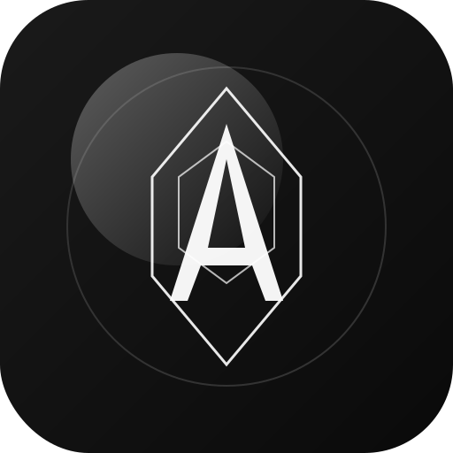

# AETHER-OS v2.2.0

**Local AI Desktop Suite with eDEX-UI Aesthetic**



## 🚀 Quick Start

### Prerequisites
- **Node.js** 18+ (https://nodejs.org)
- **Python** 3.8+ (https://python.org)
- **Ollama** (optional, for AI chat) (https://ollama.ai)

### Installation

```bash
# Clone or extract the project
cd AetherOS-v2.2

# Install Node.js dependencies
npm install

# Run in development mode
npm run dev

# Or run normally
npm start
```

## ✨ What's New in v2.2.0

### 🔌 Plugin Marketplace
- **Download plugins** directly from the Plugins tab in the launcher
- **Launch plugins like apps** - click to open in a panel
- **Uninstall plugins** with one click
- **Install from ZIP** - drag & drop plugin files

### 🔄 Fixed Auto-Updates
- Now properly checks **GitHub Releases** for updates
- Shows release notes and version comparison
- One-click download to update

### 📦 Smaller App Size
- **Viral Video Studio** moved to downloadable plugin
- Core app is now lighter
- Plugins are downloaded only if needed

### 🛠️ Bootstrap Installer (Optional)
- Create a **~2-5MB installer** instead of ~70MB
- Downloads Electron during installation
- See `installer/` directory for details

## 🏗️ Architecture

```
AetherOS-v2.2/
├── main.js                 # Electron main process
├── preload.js             # IPC bridge
├── package.json           # Dependencies & scripts
├── version.json           # Version info for updates
├── installer/             # Bootstrap installer scripts
├── src/
│   ├── orchestrator/
│   │   └── SystemOrchestrator.js  # Tool & plugin management
│   ├── renderer/
│   │   ├── loading.html   # Boot screen
│   │   └── index.html     # Main UI
│   └── tools/             # Python backend tools
│       ├── ollama_chat/   # LLM interface (port 5003)
│       ├── image_gen/     # Image generation (port 5004)
│       ├── tts_engine/    # Text-to-speech (port 5005)
│       ├── stt_engine/    # Speech-to-text (port 5006)
│       ├── file_manager/  # File browser (port 5007)
│       ├── notes/         # Notes board (port 5008)
│       ├── system_monitor/# System stats (port 5009)
│       ├── terminal/      # Terminal (port 5010)
│       ├── code_editor/   # Code editor (port 5011)
│       ├── spreadsheet_engine/ # Spreadsheet (port 5002)
│       └── video_gen/     # Video generation (port 5012)
└── plugins/               # User-installed plugins (stored in userData)
```

## 🔌 Using Plugins

### Installing Plugins

1. Open the **Launcher** (click the grid button in the sidebar)
2. Go to the **Plugins** tab
3. **Download** from available plugins, or
4. **Drag & drop** a plugin ZIP file

### Launching Plugins

Installed plugins appear in the Plugins tab. Click any plugin to:
- **Start it** (if not running)
- **Open its panel** in the workspace

### Available Plugins

- **Viral Video Studio** - AI-powered short-form video creation
- **Calculator** - Scientific calculator (bundled)
- More coming soon...

### Creating Plugins

Create a folder in `plugins/` with:

```
plugins/my_plugin/
├── plugin.json         # Plugin metadata
├── requirements.txt    # Python dependencies
└── server.py          # Flask server with web UI
```

**plugin.json**:
```json
{
  "name": "my_plugin",
  "displayName": "My Plugin",
  "description": "Does awesome things",
  "version": "1.0.0",
  "author": "Your Name",
  "category": "productivity",
  "icon": "🚀",
  "port": 5150
}
```

**server.py** (with web UI):
```python
from flask import Flask, render_template_string
from flask_cors import CORS
import os

app = Flask(__name__)
CORS(app)

UI_HTML = '''
<!DOCTYPE html>
<html>
<head>
    <style>
        body { background: #0a0a0a; color: white; font-family: sans-serif; padding: 20px; }
    </style>
</head>
<body>
    <h1>My Plugin</h1>
    <p>Hello from the plugin!</p>
</body>
</html>
'''

@app.route('/')
def index():
    return render_template_string(UI_HTML)

@app.route('/health')
def health():
    return {"status": "ok"}

if __name__ == '__main__':
    port = int(os.environ.get('AETHER_PORT', 5150))
    app.run(host='127.0.0.1', port=port)
```

## 📦 Building for Distribution

### Standard Build (~70MB)

```bash
# Build for Windows
npm run build:win

# Build for macOS
npm run build:mac

# Build for Linux
npm run build:linux
```

### Bootstrap Build (~2-5MB installer)

See `installer/README.md` for creating a small bootstrap installer that downloads Electron during installation.

## 🔄 Auto-Updates

AETHER-OS checks GitHub Releases for updates. To publish an update:

1. Update `version.json` with new version number
2. Create a GitHub Release with:
   - Tag: `v2.2.1` (or your version)
   - Attach built installers
3. Users will be notified when they click "Check Updates"

## 🐛 Troubleshooting

### Loading stuck at 0%
Fixed in v2.1+. If still occurring:
1. Check the console (View > Toggle Developer Tools)
2. Ensure Python 3.8+ is installed and in PATH
3. Delete the `envs/` folder and restart

### Plugin not starting
1. Check if the port is already in use
2. Look at the console for Python errors
3. Ensure `requirements.txt` is valid

### Update check shows error
- Check your internet connection
- GitHub API may be rate-limited (wait a few minutes)
- The repo may not have releases yet

### Python not found
- Windows: Install from python.org and check "Add to PATH"
- macOS: `brew install python3`
- Linux: `sudo apt install python3 python3-venv python3-pip`

## 📄 License

MIT License - Feel free to use and modify!

---

Made with ⚡ by the AETHER-OS Team
